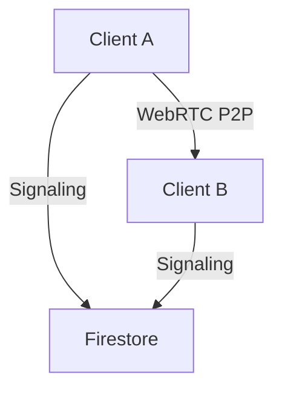

# Cultured Nomad - Connectivity Features

## Current Implementation

### 1. Real-time Chat System
- [x] One-on-one messaging
- [x] Real-time message updates
- [x] Message history
- [x] Online/offline status
- [x] Last message preview
- [x] Timestamp display
- [x] Unread message indicators

### 2. WebRTC Integration (New)
- [x] Basic WebRTC infrastructure
- [x] Audio call support
- [x] Video call support
- [x] Mute/unmute controls
- [x] Picture-in-Picture for video calls
- [x] Basic call UI (WhatsApp-inspired)

### 3. Firebase Integration
- [x] Firestore for message storage
- [x] Firestore for signaling (WebRTC)
- [x] Real-time listeners
- [x] Optimized for Spark plan usage

## Planned Improvements

### 1. Call Features
- [ ] Screen sharing
- [ ] Background blur
- [ ] Call recording
- [ ] Group calls
- [ ] Call quality indicators
- [ ] Bandwidth adaptation
- [ ] Call fallback options

### 2. Chat Enhancements
- [ ] Message reactions
- [ ] File sharing
- [ ] Voice messages
- [ ] Message search
- [ ] Chat backup
- [ ] Message formatting
- [ ] Link previews

### 3. Connection Improvements
- [ ] TURN server implementation
- [ ] Connection quality monitoring
- [ ] Automatic reconnection
- [ ] Network status indicators
- [ ] Offline message queueing
- [ ] Call scheduling

### 4. Security & Privacy
- [ ] End-to-end encryption
- [ ] Call encryption
- [ ] Privacy settings
- [ ] Session management
- [ ] Device management

## Technical Considerations

### Current Architecture

### Firebase Spark Plan Limitations
1. **Storage**
   - 1GB storage limit
   - 10GB/month transfer
   - 5GB Storage bucket

2. **Connections**
   - Limited concurrent connections
   - No dedicated TURN server

3. **Operations**
   - Limited document reads/writes
   - Limited simultaneous listeners

### Optimization Strategies
1. **Data Management**
   - Implement message pagination
   - Cleanup old signaling data
   - Compress media where possible
   - Cache frequently accessed data

2. **Connection Management**
   - Use free STUN servers
   - Implement connection pooling
   - Optimize listener attachments
   - Smart reconnection strategy

3. **Resource Usage**
   - Lazy loading of media
   - Efficient indexing
   - Batch operations where possible
   - Implement rate limiting

## Development Roadmap

### Phase 1 (Current)
- [x] Basic WebRTC implementation
- [x] Audio/Video calls
- [x] Basic UI controls
- [x] Firebase signaling

### Phase 2 (Next Steps)
- [ ] Error handling improvements
- [ ] Connection stability
- [ ] UI/UX polish
- [ ] Call quality optimizations

### Phase 3 (Future)
- [ ] Advanced features
- [ ] Group calling
- [ ] Screen sharing
- [ ] Recording capabilities

### Phase 4 (Scale)
- [ ] Custom TURN server
- [ ] Load balancing
- [ ] Analytics
- [ ] Performance monitoring

## Testing & Quality Assurance

### Current Test Coverage
- [x] Basic connectivity tests
- [x] Message delivery
- [x] Authentication flows

### Needed Tests
- [ ] WebRTC connection tests
- [ ] Call quality tests
- [ ] Load testing
- [ ] Edge case handling
- [ ] Cross-browser compatibility
- [ ] Mobile device testing

## Known Issues & Limitations
1. No TURN server fallback
2. Limited by Spark plan quotas
3. Basic call quality management
4. No group call support yet
5. Limited media processing capabilities

## Best Practices Implementation
1. Always cleanup media streams
2. Handle connection states
3. Implement proper error recovery
4. Monitor connection quality
5. Optimize resource usage

## Resources & Documentation
- [WebRTC Documentation](https://webrtc.org/getting-started/overview)
- [Firebase Documentation](https://firebase.google.com/docs)
- [MDN WebRTC Guide](https://developer.mozilla.org/en-US/docs/Web/API/WebRTC_API)

## Contribution Guidelines
1. Follow existing code patterns
2. Add proper error handling
3. Document new features
4. Include test coverage
5. Consider Spark plan limitations

---

This document will be updated as new features are implemented or requirements change.
